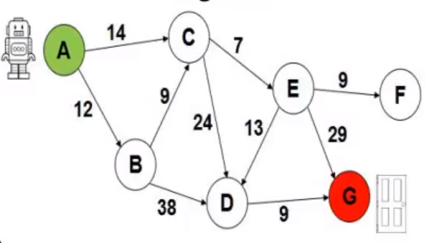

# Search A*

Implementation of search algorithm A* to present as work in AI discipline of computer science course

## Usage

First you must have Clojure and Leiningen installed [Clojure](https://clojure.org/guides/getting_started) and
[Leiningen](https://leiningen.org/#install), after entering the project directory and running in your terminal.

```bash
lein run
```


This algorithm is working with a fixed graph like the following image



and a heuristic function with the following values

A = 30  
B = 26  
C = 21  
D = 7  
E = 22  
F = 36  
G = 0  

